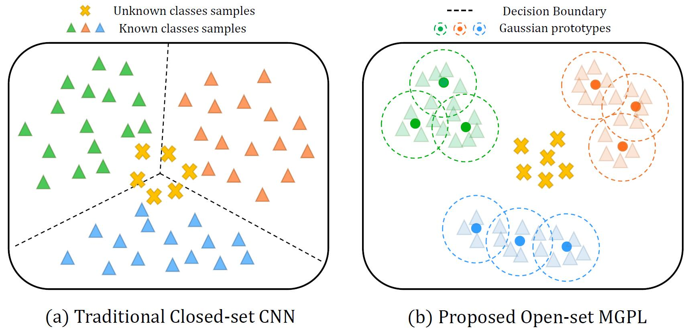

# MGPL - Learning Multiple Gaussian Prototypes for Open-set Recognition


## Abstract

Open-set recognition aims at handling unknown classes that do not exist in the training phase. To deal with this problem, the key point is to learn effective latent feature representations which are capable of classifying known classes as well as detecting new emerging classes. In this paper, we learn multiple Gaussian prototypes for better representing the complex classes distribution in both generative and discriminative ways. Under the generative constraint, the latent variables of the same class will cluster around the corresponding Gaussian prototypes compactly, reserving extra space for the unknown classes samples. The discriminative constraint drives the Gaussian prototypes of different classes separating from each other that further improving the capability of discrimination for the known classes. Importantly, the entire framework can be derived directly from the Bayesian inference, thus providing theoretical support for open-set recognition. Experimental results on different datasets verify the reliability and effectiveness of the proposed method.




## Usage

Train the MGPL model with cifar10 dataset by

  ```
  python train.py --dset cifar10 --split 0
  ```

Then test to obtain the result by

  ```
  python test.py --dset cifar10 --split 0
  ```


## Note

We use the same known-open classes split as [OSRCI](https://github.com/lwneal/counterfactual-open-set) for fair comparision.


##Bibtex

@article{LIU2023738,
title = {Learning multiple gaussian prototypes for open-set recognition},
journal = {Information Sciences},
volume = {626},
pages = {738-753},
year = {2023},
issn = {0020-0255},
doi = {https://doi.org/10.1016/j.ins.2023.01.062},
url = {https://www.sciencedirect.com/science/article/pii/S0020025523000622},
author = {Jiaming Liu and Jun Tian and Wei Han and Zhili Qin and Yulu Fan and Junming Shao},
}
